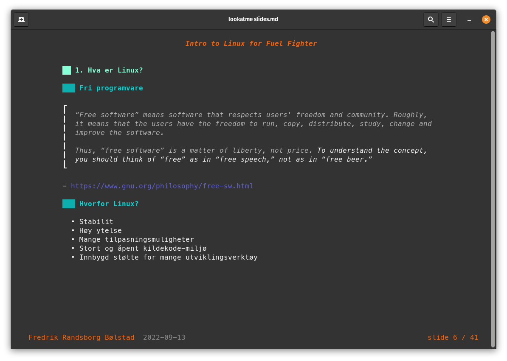
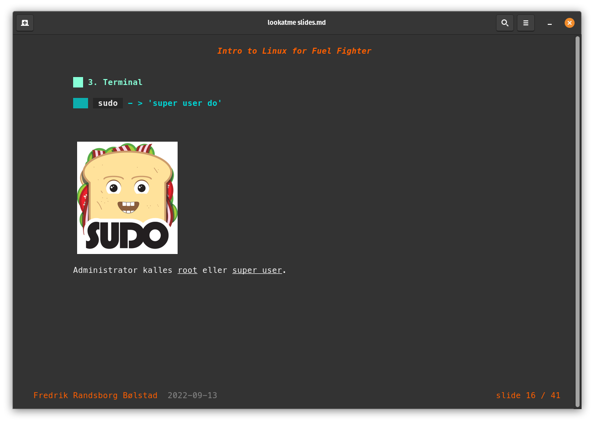
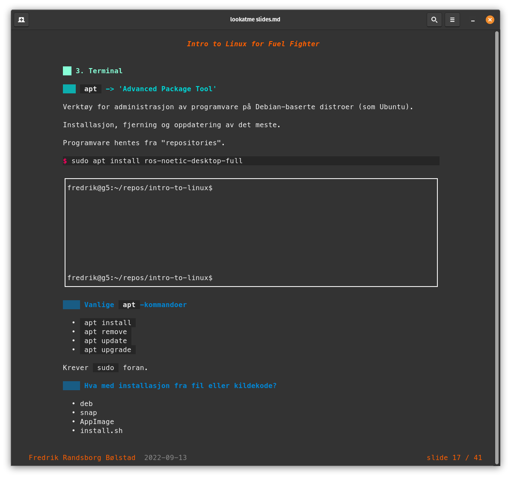

# Intro to Linux

This repository contains the source files for a very basic Linux introduction lecture given to new members of [Fuel Fighter](https://www.fuelfighter.no/) at the beginning of the semester. It assumes little-to-no prior experience with Linux. It's meant to motivate why Linux (which in this case means Ubuntu) is the working platform of the organization, and to provide a short primer on what they can expect in the short term. Members install Ubuntu on their own computers after the mini-presentation. 

The presentation is made using [lookatme](https://github.com/d0c-s4vage/lookatme).

## Screenshots

