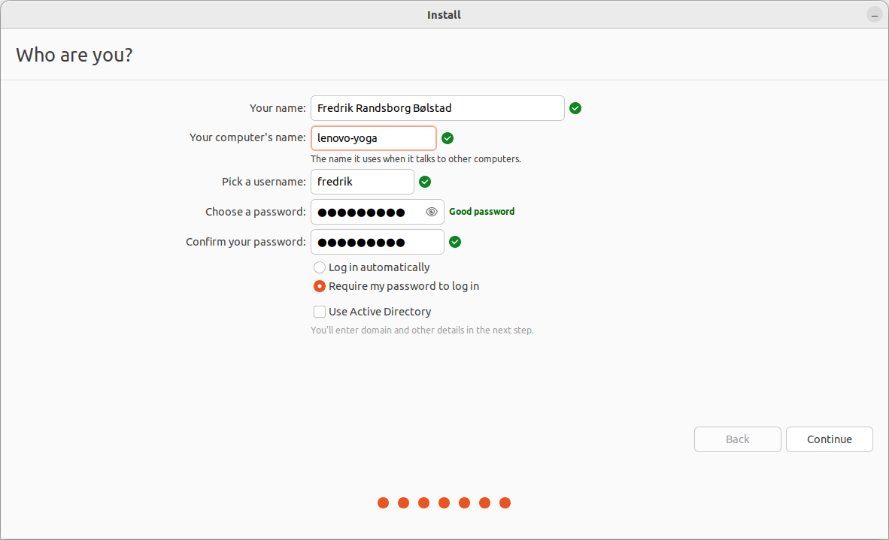

# Intro til Linux


```bash
 ______________________
< Fuel Fighter FTW! >
 ----------------------
   \
    \
        .--.
       |o_o |
       |:_/ |
      //   \ \
     (|     | )
    /'\_   _/`\
    \___)=(___/

.......................
```

---

# Agenda

## 1. Hva er Linux?

## 2. Filbehandling

## 3. Terminal

## 4. Installasjon

---

# 1. Hva er Linux?
 

 


---

# 1. Hva er Linux?
 

 

 


---

# 1. Hva er Linux?
 

 

 


---

# 1. Hva er Linux?
## Fri programvare

> “Free software” means software that respects users' freedom and community. Roughly, it means that the users have the freedom to run, copy, distribute, study, change and improve the software.

> Thus, “free software” is a matter of liberty, not price. *To understand the concept, you should think of “free” as in “free speech,” not as in “free beer.”*

\- https://www.gnu.org/philosophy/free-sw.html

## Hvorfor Linux?

- Stabilit
- Høy ytelse
- Mange tilpasningsmuligheter
- Stort og åpent kildekode-miljø
- Innbygd støtte for mange utviklingsverktøy

---

# 1. Hva er Linux?

## Hvem bruker Linux?
 

 


International Space Station

---

# 1. Hva er Linux?

## Hvem bruker Linux?
 

 


Alle de 500 raskeste datamaskinene i verden

Kilde: https://top500.org/statistics/list/

---

# 1. Hva er Linux?

## Hvem bruker Linux?
 

 


Kilde: https://source.android.com/

---

# 1. Hva er Linux?

## Hvem bruker Linux?
 

 


Kilde: https://www.automotivelinux.org/about/members/

---


# 1. Hva er Linux?

## Hvem bruker Linux?
 

 


Kilde: https://sitereport.netcraft.com/?url=http://microsoft.com

---

# 2. Filbehandling

## Mappestruktur
 

 


---

# 2. Filbehandling

## Mappestruktur
 

 


---

# 2. Filbehandling

## Mappestruktur
 

 


### `tar.gz`
- Komprimerte filer lagres typisk som `arkiv.tar.gz`
- Disse må pakkes ut på samme måte som .zip-filer

---

# 3. Terminal
 

 


## Hvorfor Terminal?

1. Kan gjøre "alt"
2. Fleksibelt
3. Krever få ressurser

## Resultat
- Mye foregår i Terminal
- Scripting av vanlige oppgaver
- Lett å følge guider

---

# 3. Terminal

## `sudo` - > 'super user do' 
 

 


Administrator kalles **root** eller **super user**.

---

# 3. Terminal

## `apt` -> 'Advanced Package Tool'

Verktøy for administrasjon av programvare på Debian-baserte distroer (som Ubuntu).

Installasjon, fjerning og oppdatering av det meste.

Programvare hentes fra "repositories".

```shell-session
$ sudo apt install ros-noetic-desktop-full

```

```terminal11
bash -il
```

### Vanlige `apt`-kommandoer
- `apt install`
- `apt remove`
- `apt update`
- `apt upgrade`

Krever `sudo` foran.

### Hva med installasjon fra fil eller kildekode?
- deb
- snap
- AppImage
- install.sh


---

# 3. Terminal

## Navigasjon

| Kommando | Beskrivelse             |       | Annet  |                                  |
| :------- | :---------------------- | :---: | :----: | :------------------------------- |
| `pwd`    | print working directory |  \|   |   .    | refererer til `pwd`              |
| `ls`     | list                    |  \|   |   ..   | refererer til ett nivå opp       |
| `cd`     | change directory        |  \|   |   ~    | refererer til `/home/$(whoami)/` |
| `mv`     | move                    |  \|   | `nano` | teksteditor                      |
| `rm`     | remove                  |  \|   | `cat`  | dump innhold i fil               |

```terminal25
bash -il
```

-> Tips: Søk etter cheatsheets

---

# 3. Terminal

## Diverse nyttig

### Piltast, TAB og `!!`

- Pil opp og ned blar i historikk
- TAB = autocomplete (dobbelklikk for å se muligheter)
- `!!` er forrige kommando (f.eks. `sudo !!`)

### Kjøre scripts
1. Gjør executable: `chmod +x <fil>`
2. Kall script: `/sti/til/script.sh` (ofte bare `./script.sh`)

### `$PATH` 
- Kjørbare filer kan kalles uten sti dersom de ligger i `$PATH`
- `which <kommando>` gir full sti til programmet

### Dokumentasjon
- `<kommando> --help`
- `man <kommando>`

### Tastatursnarveier

| Funksjon            | Snarvei          |
| :------------------ | :--------------- |
| Avbryt/lukk process | Ctrl + C         |
| Kopier              | Ctrl + Shift + C |
| Lim inn             | Ctrl + Shift + V |
| Åpne Terminal       | Ctrl + Alt + T   |
| Lukke Terminal      | Ctrl + D         |

---

# 4. Installasjon

## Dual boot

- Installer Ubuntu ved siden av Windows eller macOS.
- Velg operativsystem ved oppstart.

## Virtualisert maskin

- Installer programvare som lager en virtuell maskin.
- Installer Ubuntu på denne virtuelle maskinen.

--


Dual boot er generelt å foretrekke men ikke alltid mulig.

---

# 4. Installasjon

## Forberedelser

- Backup
- Deaktiver kryptering
- Partisjoner harddisk

## Potensielle problemer

- Maskinvare virker ikke
  - Nettverkskort
  - Grafikkort
- Maskinen starter ikke
  - Korrupte instillinger for oppstart
  - Sannsynligvis er det meste likevel i orden

---

# 4. Installasjon

## Kjapp gjennomgang

### Deaktiver kryptering

  


---

# 4. Installasjon

## Kjapp gjennomgang

### Deaktiver kryptering

  


---

# 4. Installasjon

## Kjapp gjennomgang

### Partisjonering av harddisk

  


---

# 4. Installasjon

## Kjapp gjennomgang

### Partisjonering av harddisk

  


---

# 4. Installasjon

## Kjapp gjennomgang

### Lag bootable USB

  


Link: https://www.balena.io/etcher/

---

# 4. Installasjon

## Kjapp gjennomgang

### Start maskinen fra USB-penn

  


---

# 4. Installasjon

## Kjapp gjennomgang

### Prøv Ubuntu

  


---

# 4. Installasjon

## Kjapp gjennomgang

### Prøv Ubuntu

  


---

# 4. Installasjon

## Kjapp gjennomgang

### Prøv Ubuntu

  


---

# 4. Installasjon

## Kjapp gjennomgang

### Prøv Ubuntu

  


---

# 4. Installasjon

## Kjapp gjennomgang

### Installer Ubuntu

  


---

# 4. Installasjon

## Kjapp gjennomgang

### Installer Ubuntu

  


---

# 4. Installasjon

## Kjapp gjennomgang

### Installer Ubuntu

  


---

# 4. Installasjon

## Kjapp gjennomgang

### Installer Ubuntu

  


---

# 4. Installasjon

## Kjapp gjennomgang

### Installer Ubuntu

  


---

# 4. Installasjon

## Kjapp gjennomgang

### Installer Ubuntu

  


---

# 4. Installasjon

## Kjapp gjennomgang

### Installer Ubuntu

  


---

# 4. Installasjon

## Kjapp gjennomgang

### Installer Ubuntu

  


---

# 4. Installasjon

## Kjapp gjennomgang

### Installer Ubuntu

  


---

# 4. Installasjon

## Oppsummering

1. Backup
2. Krymp og partisjoner harddisken
3. Deaktiver kryptering
4. Last ned Ubuntu og lag bootable USB
5. Start maskinen fra USB
6. Prøv Ubuntu - sjekk WiFi
7. Følg installasjonsveiviseren
   - "Install third-party software" 
   - "Install Ubuntu alongside Windows Boot Manager"
8. Restart
   - Bekreft at både Windows/macOS og Ubuntu starter

```
 ___________
< Spørsmål? >
 -----------
        \   ^__^
         \  (oo)\_______
            (__)\       )\/\
                ||----w |
                ||     ||
             --------------
```

### Problemer
- Spør meg
- Google / DuckDuckGo
- Hjelp hverandre
- Orakeltjenesten